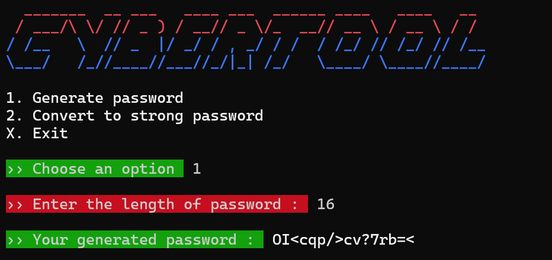
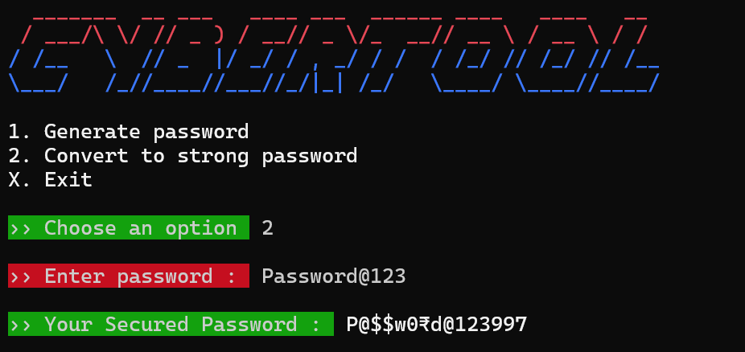

# CYBERTOOL
Cybertool is a tool to Generate Strong Passwords.

It can also Convert Normal password to a Strong passwords.

## Installation
Follow below steps to install CYBERTOOL.

Open Terminal and paste & run below codes one by one.

Note: Python 3 is needed to use this Tool.

```bash
 git clone https://github.com/iamjinx/cybertool.git

 cd cybertool

 pip  install -r requirements.txt

```
## Usage
To use the tool follow Instruction below.
1. Go the the Cybertool folder inside terminal.

```bash
 cd cybertool

```
2. Next run below code.

```python
 python cybertool.py

```
3. Choose option 1 to Generate a password.



4. Else choose option 2 to Convert a Normal password into a Strong password.



## License

©iamjinx - 2021 Ltd.

TELEGRAM ID: @iamjinnx
